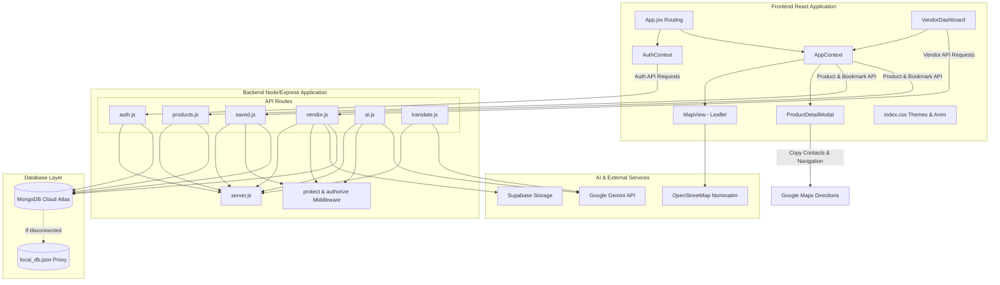

# ♻️ ReLoop: Hyperlocal Sustainability Surplus Marketplace

> **Rescue Today, Impact Tomorrow.**
>
> ReLoop is a premium hyperlocal marketplace dedicated to retail sustainability and surplus optimization. By connecting local vendors (bakeries, grocers, dairies, and retail stores) directly with residents, ReLoop ensures fresh inventory is sold—not wasted.

---

## 📖 Table of Contents
1. [Core Features](#-core-features)
2. [Premium Visual Design & Animations](#-premium-visual-design--animations)
3. [System Architecture](#-system-architecture)
4. [Technology Stack](#-technology-stack)
5. [Database Proxy Layer (High Availability)](#-database-proxy-layer-high-availability)
6. [Gemini AI & Localization Pipelines](#-gemini-ai--localization-pipelines)
7. [Installation & Setup](#-installation--setup)
8. [Directory Structure](#-directory-structure)
9. [Future Roadmap](#-future-roadmap)

---

## ✨ Core Features

### 📍 Hyperlocal Clearance Map
* Fully interactive maps powered by [Leaflet](https://leafletjs.com/) and [React Leaflet](https://react-leaflet.js.org/).
* Custom rotatable map pins dynamically colored based on deal expiry limits:
  * 🟢 **Green (Fresh Deal):** Expiring in $> 24\text{ hours}$.
  * 🟠 **Orange (Near Expiry):** Expiring in $4\text{ to }24\text{ hours}$.
  * 🔴 **Red (Last Chance):** Expiring in $< 4\text{ hours}$.
* Auto-triggering popups on pin hover and custom click handlers to expand item profiles in overlay drawers.
* Google Maps direction helper integration to automatically navigate clients directly to the shop (`Navigate to Shop`).

### 🤖 Gemini AI Visual Listing Scanner
* Upload a surplus product image and let Gemini AI write your inventory listing.
* Integrates Google Gemini (`gemini-2.5-flash`) via the `@google/generative-ai` SDK to scan images and produce structured JSON advice.
* Automatically generates:
  * **Product Title & Category** (e.g., Bakery, Dairy, Produce, Furniture).
  * **Persuasive Description** describing clearance state and sustainability impact.
  * **Original Retail Price & Markdown Price** (recommends realistic $40\%-75\%$ clearance discounts).
* Includes a smart keyword-match local catalog lookup to act as a fallback when API keys are absent.

### 🌐 Batch-Optimized Multi-tier Localization
* Toggles the user interface completely between English and Hindi.
* Leverages Google Translation REST endpoints, falling back to Gemini structured translations, and falling back to local dictionaries.
* Implements a **Batch Translation helper** to reduce external API requests: groups all product names, categories, and descriptions into a single bulk array string collection per fetch.

### 📊 Vendor Performance & Impact Dashboard
* Track active listings, happy customers, and environmental metrics.
* Displays dynamic count-up KPI tickers for:
  * **Revenue Recovered** (₹).
  * **Products Rescued** (units).
  * **Waste Prevented** (measured in kilograms, assuming an average of 1.2 kg per food/retail item rescued).
* Notion-style inventory panel allowing vendors to quickly create listings, delete items, toggle availability status, and view product details.

---

## 🎨 Premium Visual Design & Animations

ReLoop features a high-fidelity visual layout configured in [index.css](file:///c:/Users/aksha/.gemini/antigravity-ide/scratch/reloop-app/frontend/src/index.css):
* **Dual Theme Design Token System:**
  * **Light Theme:** Warm cream-ivory canvas, `#9E9770` brownish-beige accents and borders, and forest green UI elements.
  * **Dark Theme:** Premium charcoal `#080A10` backdrop, deep slate-navy `#111422` containers, `#232B44` borders, and high-contrast `#10B981` emerald details.
* **Micro-Animations:**
  * Staggered card fade-ins using keyframed translations.
  * Spring-scaling transitions on navigation buttons and links.
  * High-performance **60fps metrics counters** in [VendorDashboard.jsx](file:///c:/Users/aksha/.gemini/antigravity-ide/scratch/reloop-app/frontend/src/pages/VendorDashboard.jsx) counting up dashboard figures dynamically.

---

## 🏗️ System Architecture



---

## 🛠️ Technology Stack

### Frontend
* **Core Framework:** [Vite](https://vitejs.dev/) + [React](https://react.dev/)
* **Maps Integration:** [Leaflet](https://leafletjs.com/) & [React Leaflet](https://react-leaflet.js.org/)
* **Icons Library:** [Lucide React](https://lucide.dev/)
* **Styles Engine:** Vanilla CSS Custom Variables (Dynamic dual-mode styling)

### Backend
* **Runtime Environment:** [Node.js](https://nodejs.org/)
* **API Framework:** [Express.js](https://expressjs.com/)
* **File Upload Processor:** [Multer](https://github.com/expressjs/multer)
* **Auth System:** JSON Web Tokens (JWT) & bcryptjs encryption

### Databases & Cloud Storage
* **Production Database:** [MongoDB Cloud Atlas](https://www.mongodb.com/atlas/database) with [Mongoose ODM](https://mongoosejs.com/)
* **Development Fallback:** Local JSON Proxy Store
* **Cloud Storage:** [Supabase Storage Bucket](https://supabase.com/docs/guides/storage) (Optional fallback to local file system)

---

## 💾 Database Proxy Layer (High Availability)

ReLoop implements a unique database wrapper setup inside [User.js](file:///c:/Users/aksha/.gemini/antigravity-ide/scratch/reloop-app/backend/models/User.js) and [Product.js](file:///c:/Users/aksha/.gemini/antigravity-ide/scratch/reloop-app/backend/models/Product.js) to allow the app to run without MongoDB:

```
                  ┌──────────────┐
                  │ connectDB()  │
                  └──────┬───────┘
                         │
               Does MongoDB connect?
               ──────┬─────────┬──────
             Yes     │         │   No
                     ▼         ▼
          [Mongoose Driver]  [Local JSON DB Fallback]
```

1. **Automatic Detection:** The wrapper inspects `mongoose.connection.readyState`.
2. **Real Database:** If MongoDB is connected, queries are passed directly to the Mongoose ODM driver.
3. **JSON Database Fallback:** If MongoDB is disconnected, it intercepts queries and executes them against a local file [local_db.json](file:///c:/Users/aksha/.gemini/antigravity-ide/scratch/reloop-app/backend/local_db.json) via load/save file buffers.
4. **MockQuery Chain Engine:** To support Mongoose's chain syntax, the fallback returns an instance of `MockQuery` supporting fluent methods (`.populate()`, `.sort()`, `.select()`, `.exec()`, and `.then()`).

---

## 🔌 Gemini AI & Localization Pipelines

### 📸 Visual Form Analysis
```
Upload Image ──► Base64 Convert ──► Send to Gemini ──► Receive Form JSON ──► Auto-Fill Form
```
* **Endpoint:** `POST /api/ai/analyze` (Restricted to logged-in Vendors).
* Sends the image together with a structured system prompt asking for valid JSON response mapping to the product schema.
* Extrapolates standard retail value and advises a recommended clearance pricing based on shelf-life and perishability.

### 🌐 Batch Translation Flow
```
Flatten Array ──► Query Translator ──► Retrieve Translations ──► Map Index Back to Products
```
To avoid making translation requests for every individual item card in the UI feed, ReLoop flattens fields into a single batch:
* **Payload Structure:** `["Item 1 Name", "Item 1 Category", "Item 1 Desc", "Item 2 Name", ...]`
* **Translation Handler:** The backend [translate.js](file:///c:/Users/aksha/.gemini/antigravity-ide/scratch/reloop-app/backend/routes/translate.js) controller queries Google Cloud Translation, falling back to a structured prompt to Gemini, returning a matching translated array.
* **Client Mapping:** Re-indexes the returned translated collection back into the React product state variables.

---

## 🚀 Installation & Setup

### Prerequisites
* [Node.js](https://nodejs.org/) (v16.x or higher)
* [npm](https://www.npmjs.com/) (v8.x or higher)
* (Optional) [MongoDB Atlas connection string](https://www.mongodb.com/)
* (Optional) [Google Gemini API Key](https://ai.google.dev/)
* (Optional) [Supabase Storage Bucket project](https://supabase.com/)

### 1. Clone the Project
```bash
git clone https://github.com/Akshaaa08/ReLoop.git
cd reloop-app
```

### 2. Configure Environment Settings
Create a `.env` file in the `backend/` directory:
```env
PORT=5000
MONGO_URI=your_mongodb_atlas_connection_string
JWT_SECRET=your_jwt_signing_secret_phrase

# Google Gemini API Key
GEMINI_API_KEY=your_gemini_api_key

# Optional: Supabase Bucket Storage Configuration
SUPABASE_URL=https://your_project.supabase.co
SUPABASE_ANON_KEY=your_supabase_anon_public_key
SUPABASE_BUCKET=reloop

# Optional: Google Translation API
GOOGLE_TRANSLATE_API_KEY=your_google_cloud_translation_api_key
```
> **Note:** If `MONGO_URI` is omitted or cannot connect, the system will transparently fall back to using the local [local_db.json](file:///c:/Users/aksha/.gemini/antigravity-ide/scratch/reloop-app/backend/local_db.json) file.

### 3. Install Dependencies
**Backend:**
```bash
cd backend
npm install
```

**Frontend:**
```bash
cd ../frontend
npm install
```

### 4. Run Locally
**Start Backend Server:**
```bash
cd backend
npm run dev
```
*(Runs by default on http://localhost:5000)*

**Start Frontend Application:**
```bash
cd ../frontend
npm run dev
```
*(Runs by default on http://localhost:5173, configured to proxy API queries automatically to port 5000)*

---

## 📁 Directory Structure

```text
reloop-app/
├── backend/
│   ├── config/
│   │   ├── db.js             # Mongoose driver connection
│   │   ├── dbFallback.js     # MockQuery class query chain engine
│   │   ├── inMemoryDb.js     # Local JSON read/write file triggers
│   │   └── supabase.js       # Supabase Client configuration
│   ├── middleware/
│   │   └── auth.js           # JWT verification & role authorization
│   ├── models/
│   │   ├── Product.js        # Product Schema proxying local file database
│   │   └── User.js           # User Schema proxying local file database
│   ├── routes/
│   │   ├── ai.js             # Gemini image analysis route
│   │   ├── auth.js           # Authentication register & login routes
│   │   ├── products.js       # Geospatial search and product lists
│   │   ├── saved.js          # Bookmarked lists for customers
│   │   ├── translate.js      # Translation endpoints
│   │   └── vendor.js         # Vendor listing operations and KPI statistics
│   ├── uploads/              # Local Multer upload storage folder
│   ├── local_db.json         # Seeding file for local JSON fallback DB
│   └── server.js             # Express application initialization
│
└── frontend/
    ├── public/               # Public assets
    └── src/
        ├── components/
        │   ├── AddProductWizard.jsx     # Wizard to upload & analyze image
        │   ├── DealCard.jsx             # Individual product grid item
        │   ├── MapView.jsx              # Leaflet Map setup
        │   ├── Navbar.jsx               # Navigation controls and language triggers
        │   ├── ProductDetailModal.jsx   # Detail overlay with map directions
        │   └── Sidebar.jsx              # Navigation panel for vendors
        ├── context/
        │   ├── AppContext.jsx           # App state: theme, language, alerts
        │   └── AuthContext.jsx          # Auth state: sessions, coords, logins
        ├── pages/
        │   ├── AuthPage.jsx             # Combined Login / Signup panel
        │   ├── Home.jsx                 # Customer landing screen & category feeds
        │   ├── ProductDetails.jsx       # Isolated product detail views
        │   ├── SavedDeals.jsx           # Saved list overview for customers
        │   └── VendorDashboard.jsx      # Metrics counters & inventory listing table
        ├── utils/
        │   └── translate.js             # Static dictionaries and batch translations
        ├── App.css                      # Base layout components styles
        ├── index.css                    # Color system tokens & animations
        └── main.jsx                     # React DOM injection point
```

---

## 🔮 Future Roadmap
- [ ] **Real-time Preorders & Chat:** Enable direct messaging between vendors and customers inside the app.
- [ ] **Smart Push Notifications:** Send local alerts to users when a shop within $500\text{ meters}$ posts a high-discount deal.
- [ ] **Carbon Offset Analytics:** Quantify and award carbon credits directly to users' profiles based on the volume of food waste prevented.
- [ ] **Automated Expiry Alerts:** Leverage background chron tasks to notify vendors of listings that have expired.

---

## 💚 Sustainability Pledge
Every listing created and claimed on ReLoop diverts organic matter from municipal landfills, directly reducing methane emissions and supporting Pune's local circular economy. 

**Join us in reducing food waste—one neighborhood deal at a time!**
